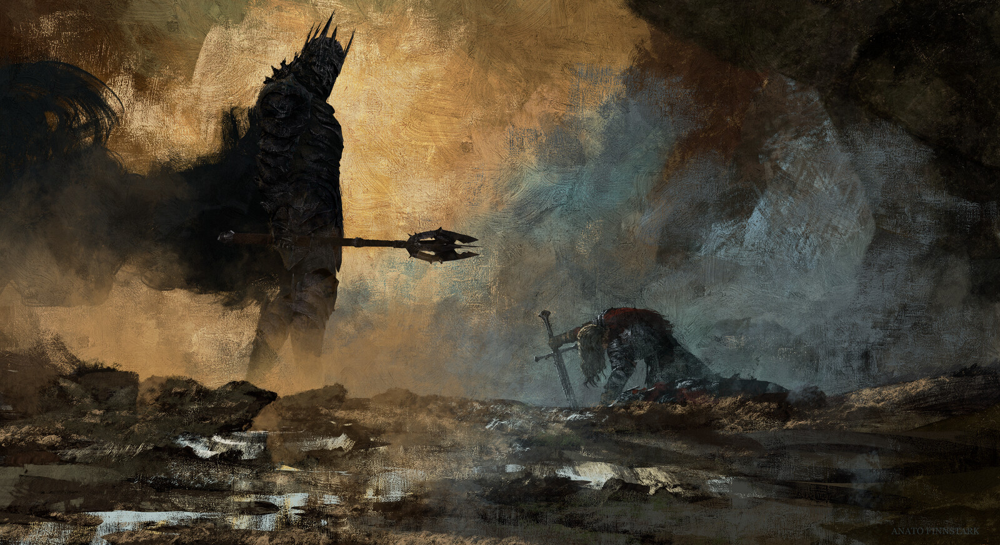

# Final Project C207L1 C206L1

## Description
This project aims to glorify the beauty of J.R.R. Tolkien's Middle-earth works. 
It was based on the works of the Second Age, on the battle of the Last Alliance, where Men and Elves united for the last time, before the events of the War of the Ring and the Fellowship of the Ring in The Lord of the Rings trilogy, to fight Sauron's forces in Barad-dûr. 
After a battle that led to the death of Elendil, the king of men, Isildur, the then prince and future king, used his father's sword to defeat Sauron, cutting the One Ring from his finger.

  

 

## Concepts
In the project, some concepts learned in C206 (Java OOP) and C207 (MySQL) were applied, such as:
- Classes;
- Abstract Classes;
- Inheritance;
- Polymorphism;
- Interaction interface;
- Java collections;
- Maven;
- CRUD;
- Relationships;

## Code features
- The code is a game based on the Decision Making format;
- The code displays the characteristics of your character and the enemies you face;
- It stages the battle and updates the data while displaying it on the console;

